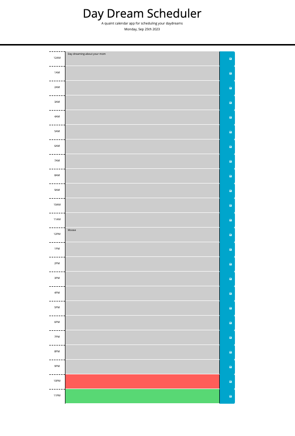

# M5 CHALLENGE - Third Party APIs: Weekly Planner

## My Task

Create a simple calendar application that allows a user to save events for each hour of a typical working day (9am&ndash;5pm) by modifying starter code. This app will run in the browser and feature dynamically updated HTML and CSS powered by jQuery.

**Use [Day.js](https://day.js.org/en/) library to work with date and time.**

## User Story

**AS AN** employee with a busy schedule

**I WANT** to add important events to a daily planner

**SO THAT** I can manage my time effectively

## Acceptance Criteria

**GIVEN** I am using a daily dream planner to create a schedule of day dreams

**WHEN** I open the planner

**THEN** the current day is displayed at the top of the calendar

**WHEN** I scroll down

**THEN** I am presented with a 24-hour timetable

**WHEN** I view the timeblocks for that day

**THEN** each timeblock is color coded to indicate whether it is in the past, present, or future

**WHEN** I click into a timeblock

**THEN** I can enter a daydream

**WHEN** I click the save button for that timeblock

**THEN** the text for that day dream is saved in local storage

**WHEN** I refresh the page

**THEN** the saved events persist

## Mock-Up

The following animation demonstrates the application functionality:

<!-- @TODO: create ticket to review/update image) -->

## Project Screen Grab

The following image shows my finished project:

## Changes Made to Code

> **All changes have been documented as comments in HTML,CSS, and JS**

## Link to Website

[CHRISTINE'S PROJECT](https://christiecamp.github.io/dream-week/)

## Submitted Pieces

I have submitted the below:

* The URL of the deployed application.

* The URL of the GitHub repository, with a unique name and a README that describes the project.